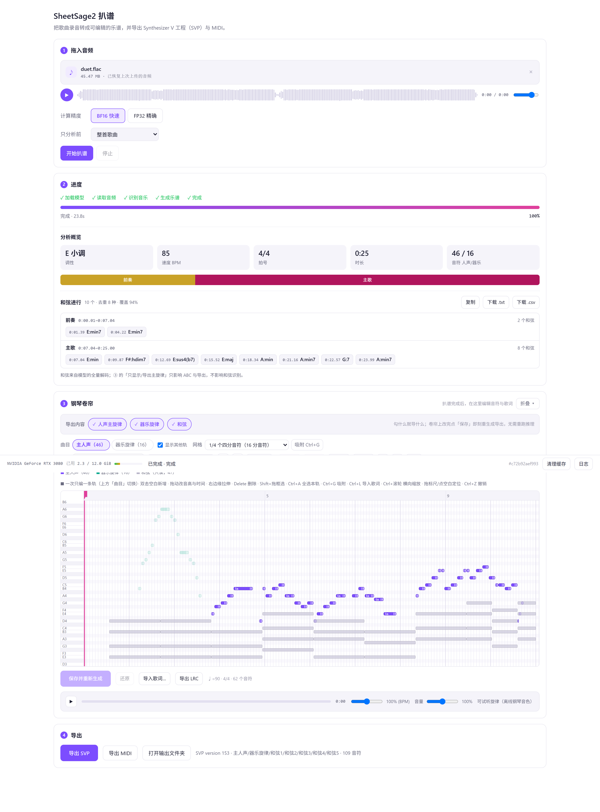

# SheetSage2 WebUI · 音频一键扒谱

把一首歌的录音丢进去，自动扒出**主旋律 / 器乐 / 和弦 / 节拍 / 调性 / 段落**，并导出成 **Synthesizer V 工程（`.svp`）/ MIDI / ABC 乐谱**。



---

## 用途

做翻唱 / 调音的人有个很具体的卡点：**拿到一首要翻唱的歌，拿不到谱子。**人耳扒谱慢且容易错，而市面上要么是给专业音乐人的付费软件，要么只输出一堆没有结构信息的音符。这个项目的目标就是补上这一段：**拖进去一首歌，得到一份能直接改、能直接唱的工程。**它比"音高转 MIDI"多做了这些事：

| | 常见的音高转换类工具 | 本项目 |
| --- | --- | --- |
| 对音频的"理解" | 逐帧音高 → 音符 | **调性 / 速度表 / 分段和弦进行 / 曲式结构** |
| 输出 | SVP 或 MIDI（通常单旋律） | **SVP + MIDI + ABC**，人声主旋律 / 器乐旋律 / 和弦**多轨可选** |
| 编辑闭环 | 无 | ABC 在线编辑 → 重新生成 → 离线钢琴试听（**谱面高亮**）→ 导出 |
| 部署 | 需自建环境 | 整合包解压即用；源码也给了权重下载脚本 |
| 隐私 | 视实现 | **只监听 `127.0.0.1`，推理全在本地** |

---

## 快速开始

### 方式一：整合包（推荐给只想用的人）

整合包体积偏大，通过网盘分发 —— **下载链接见 B站视频的简介与置顶评论**。

下载后**整个文件夹解压出来**，双击 `start.bat`，浏览器会自动打开 `http://127.0.0.1:8777/`。

| 包 | 大小 | 说明 |
| --- | --- | --- |
| **full** 全量包 | 解压后约 6 GB | 自带便携 Python + ffmpeg + 权重，**断网也能跑** |
| **lite** 轻量包 | 解压后约 330 MB | 首次运行联网下载约 3 GB 环境与权重，之后可离线 |

> 路径里可以有中文和空格，但**不要放在 OneDrive / 网盘的同步目录**里。

### 方式二：从源码跑

要求 **Windows x64 + Python 3.12**，且 `ffmpeg` 在 `PATH` 上。（Linux / macOS 理论可行但**未验证**——便携运行时和 ffmpeg 都是 Windows x64。）

```bat
:: 1) 环境
uv venv --python 3.12 .venv
uv pip install --python .venv\Scripts\python.exe -r requirements-base.txt

::    要 GPU 加速就换上 CUDA 版 torch（版本必须与 torchaudio 完全一致）
uv pip install --python .venv\Scripts\python.exe ^
    torch==2.10.0 torchaudio==2.10.0 --index-url https://download.pytorch.org/whl/cu130

:: 2) 模型权重（约 2.6 GB，仓库不带权重，原因见「许可」）
.venv\Scripts\python.exe -m pip install -U huggingface_hub
.venv\Scripts\huggingface-cli.exe login
.venv\Scripts\python.exe tools\download_models.py

:: 3) 启动
start.bat
```

> **权重是 gated 的**：先在[m-a-p/SheetSage2](https://huggingface.co/m-a-p/SheetSage2) 与[m-a-p/MERT-v2-FullSong](https://huggingface.co/m-a-p/MERT-v2-FullSong)页面各点一次同意，再 `huggingface-cli login`。国内网络可先 `set HF_ENDPOINT=https://hf-mirror.com`。

没有显卡也能跑：程序会自动判定设备，不行就退回 CPU（5 分钟的歌约 15–40 分钟）。详细用法（每一步界面在干什么、产物在哪、常见报错怎么办）见[`docs/使用说明.md`](docs/使用说明.md)。

---

## 工作流

```
拖入音频 → 推理（GPU 或 CPU）→ 分析概览 → 乐谱编辑 → 歌词填充 → 导出
                                  ↑                          ↓
                          调性/速度/段落/和弦进行      .svp / .mid / .abc
```

导出的东西：

```
output/<日期时间>_<任务号>/
    export/<歌名>.svp     ← Synthesizer V Studio 工程（version 153）
    export/<歌名>.mid     ← 通用 MIDI
    export/<歌名>.abc     ← ABC 乐谱文本
    summary.json          ← 本次的参数、耗时、诊断
```

### 模型

推理基于 **SheetSage2**，由 **M-A-P（Multimodal Art Projection）** 随[**YuE2**](https://map-yue2.github.io/) 项目发布（[主仓库](https://github.com/multimodal-art-projection/YuE)），主干是 **MERT-v2-FullSong**，加装适配器，加载时自动合并。**本项目没有训练也没有修改模型**——这里做的是**工程化落地**：把模型从发布形态接成一个端到端可用、可离线分发、带验收的产品。

---

## 已知限制

* **Windows x64 only**。便携运行时与 ffmpeg 都是 Windows 版，Linux / macOS 未验证。
* **男女对唱 / 和声的逐音归属没解决**：目前只能稳定产出主旋律一条线，所以不建议直接拿它出两条人声轨。
* **单任务串行**：同时跑会 OOM。
* 歌词模板对**英文多音节**、长歌整曲映射尚未优化。
* 扒谱与和弦识别**不保证准确**，请以人耳和乐器为准。

---

## 许可与署名

**这不是一个"拿来就能商用"的开源项目**，请务必读[`THIRD_PARTY_NOTICES.md`](THIRD_PARTY_NOTICES.md)。

| 部分 | 许可 |
| --- | --- |
| 本项目原创代码（`app/` `web/` `tools/` `packaging/` `_smoke/`） | **MIT**（见 [`LICENSE`](LICENSE)） |
| **SheetSage2 / MERT-v2-FullSong 权重** | **CC BY-NC 4.0 —— 仅限非商业用途** |
| abcjs | MIT |
| FluidR3_GM 钢琴采样（Frank Wen） | CC BY 3.0 US（需署名） |
| FFmpeg | GPLv3（本项目**不分发**，请自行安装） |

* 本仓库**不分发模型权重**：体积超限，且许可与代码不同。请用 `tools/download_models.py` 从 Hugging Face 获取，并遵守其条款。
* 使用到 **MERT2** 时请标明模型名与来源仓库（`m-a-p/MERT-v2-30s`、`m-a-p/MERT-v2-FullSong`）。

---

## 致谢

* [M-A-P / YuE2](https://github.com/multimodal-art-projection/YuE) —— SheetSage2 与 MERT-v2
* [abcjs](https://abcjs.net) —— 乐谱渲染
* Frank Wen —— FluidR3_GM 音色

---

## 免责

本工具用于**音频分析**。请勿用它批量扒取他人受版权保护的作品并回头分发或商用。扒谱结果由模型自动推断，**不保证准确**。本项目与 M-A-P / YuE2 团队**没有隶属关系**，只是它们模型的其中一个使用者。